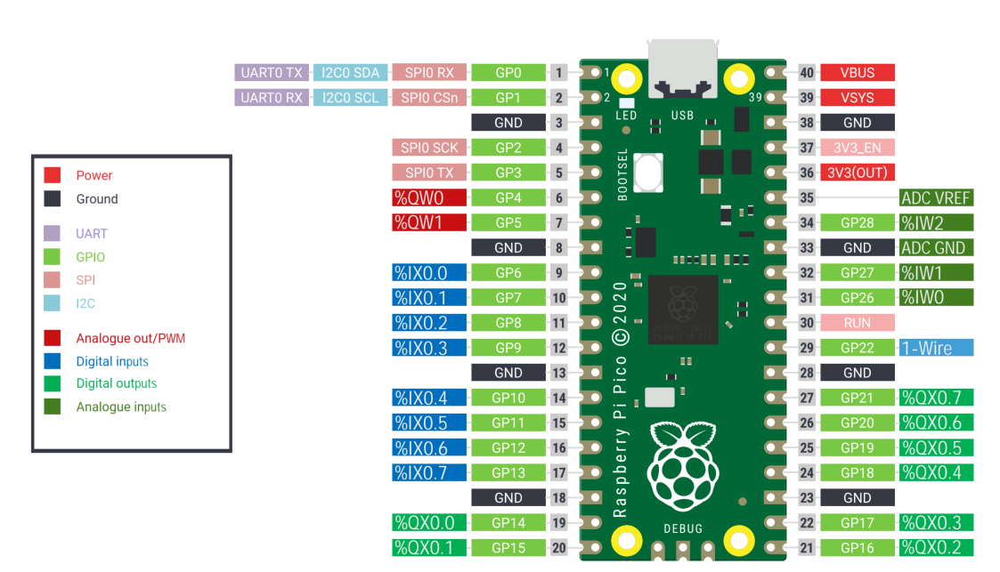
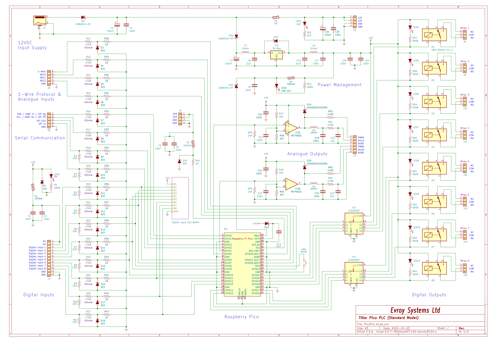

# Raspberry Pi Pico/Pico W for OpenPLC 

The goal of this addition was to create a PLC using the Pico for educational purposes. The PLC was intended to be a cost effective device that could work with OpenPLC.

It has the following features
    - 8 digital outputs using relays
    - 8 Digital inputs (3.3-5V capable)
    - 3 Analog inputs
    - 2-4 analog outputs
    - one wire communications (Dallas type or potentiall using DHT)
    - Everything the Pico/Pico W offers

## Pico pinouts & schematic mapped into OpenPLC

### Pinout

[PDF](Pico-OpenPLC-A4-Pinout.pdf)

### Schematic


[PDF](PicoPLC_schem.pdf)

### On the analogue outs

The PicoPLC was designed to woork with other firmware liek MicroPython and CircuitPython hence why I2C0,UART and SPI0 have been made available.

The rp2040pico.cpp can be ammended to allow for the addition GPIO to be used as analogue outs as per example below.

``` cpp
//OpenPLC HAL for Raspberry Pi Pico/Pico W with the RP2040

/******************PINOUT CONFIGURATION***********************
Digital In:  6, 7 ,8, 9, 10, 11, 12, 13      (%IX0.0 - %IX0.7)
Digital Out: 14, 15, 16, 17, 18, 19, 20, 21  (%QX0.0 - %QX0.7)
Analog In: A1, A2, A3 (26,27,28)             (%IW0 - %IW2)
Analog Out: 4,5                              (%QW0 - %QW1)
**************************************************************/

//Define the number of inputs and outputs for this board
#define NUM_DISCRETE_INPUT          8
#define NUM_ANALOG_INPUT            3
#define NUM_DISCRETE_OUTPUT         8
#define NUM_ANALOG_OUTPUT           2
/*
    Refer to Pico-OpenPLC-A4-Pinout.pdf & -PicoPLC schem.pdf for details
    on using the Pico/Pico W as a plc
    An additional 2 analogue outputs can be used with GPIO2 & 3 if the      
    SPI functionality is not required (adding extra code to the .ino file)     
*/
//Create the I/O pin masks
uint8_t pinMask_DIN[] = {6, 7, 8, 9, 10, 11, 12, 13};
uint8_t pinMask_AIN[] = {26, 27, 28}; 
uint8_t pinMask_DOUT[] = {14, 15, 16, 17, 18, 19, 20, 21};
uint8_t pinMask_AOUT[] = {4,5}; //2,3 can be used if SPI not required

```

## Changes & additions to OpenPLC files

- Added **OpenPLC_Editor\editor\arduino\src\rp2040pco.hal** - this provides the Arduino device information for the Pico

``` JSON

    # HAL configuration
    # Format :
    # Board type, FQBN

    Raspberry Pico,		arduino:mbed_rp2040:pico
    Raspberry Pico W,	arduino:mbed_rp2040:pico

```

- Added **rp2040pico.cpp** to provide the pin mapping
- Modified **OpenPLC_Editor\editor\arduino\builder.py** to include the required Arduino Pico build tools. These are NOT the the same as the ones for the Arduino Nano Connect.

## Other
There is working code (not yet available) for including a DHT11/22/23 module and OLED on the I2C. This was added to learn how add a new FB to the OpenPLC. This entailed editing a few extra files and adding in some more code.